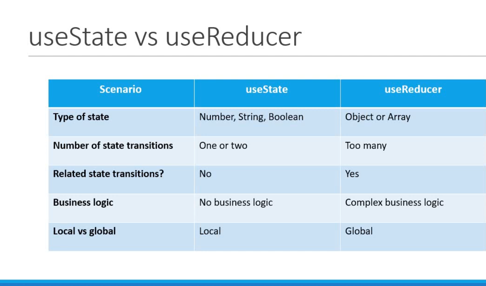

## Example of React hook useReducer

#### example-1

```js
import React, { useReducer } from "react";

const initialState = 0;
const reducer = (state, action) => {
  /**
   * reducer() accepts two values & returns one value
   * action - is like an instrunction to the reducer function
   */
  switch (action) {
    case "increment":
      return state + 1;
    case "decrement":
      return state - 1;
    case "reset":
      return initialState;
    default:
      return state;
  }
};
const Counter = () => {
  /**
   * useReducer accepts two arg
   * first arg is a function - reducer()
   * second arg is initial state - initialState
   */
  const [count, dispatch] = useReducer(reducer, initialState);
  return (
    <div>
      <div>
        <h1>Count: {count}</h1>
      </div>
      <button onClick={() => dispatch("increment")}>Increment</button>
      <button onClick={() => dispatch("decrement")}>Decrement</button>
      <button onClick={() => dispatch("reset")}>Reset</button>
    </div>
  );
};

export default Counter;
```

#### example-2 (datfetching with useReducer)

```js
import React from "react";
import { useReducer } from "react";
import { useEffect } from "react";

const initState = {
  loading: true,
  error: "",
  post: {},
};
const reducer = (state, action) => {
  switch (action.type) {
    case "FETCH_SUCCESS":
      return {
        loading: false,
        post: action.payload,
        error: "",
      };
    case "FETCH_ERROR":
      return {
        loading: true,
        post: {},
        error: "something went wrong",
      };
    default:
      return state;
  }
};
const Datafetching = () => {
  const [state, dispatch] = useReducer(reducer, initState);
  useEffect(() => {
    fetch("https://jsonplaceholder.typicode.com/posts/1")
      .then((response) => response.json())
      .then((data) => {
        dispatch({ type: "FETCH_SUCCESS", payload: data });
      })
      .catch((error) => {
        dispatch({ type: "FETCH_ERROR" });
      });
  }, []);
  return (
    <div>
      <h1>{state.loading ? "loading..." : state.post.title}</h1>
      <p>{state.error ? state.error : null}</p>
    </div>
  );
};

export default Datafetching;
```


